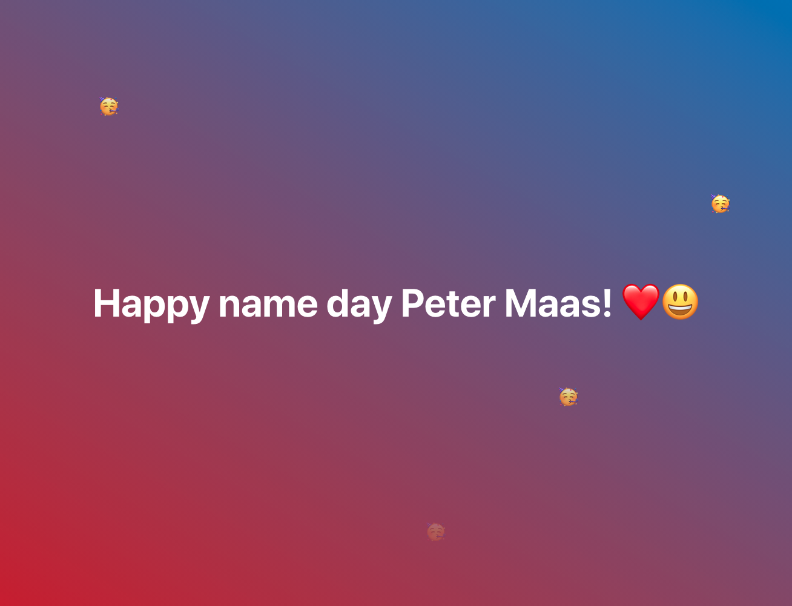

# Happy Birthday To

>Say happy birthday to anyone by changing the link path.

## Usage

* If you only want to say a simple Happy Birthday! Just use the following link: https://happy-birthday-to.vercel.app

* If you want to change what day/name/emojis to be on the page you can specify these. It is not required to set all of them you can choose whatever you want if you don't specify a parameter it is gonna be the default one. In parameter values if you want to write a space you could use '_'. And currently the available emoji keys are the followings:

| Key       | Emoji |
|-----------|-------|
| smile     | 😃     |
| cake      | 🎂     |
| celebrate | 🥳     |
| party     | 🎉     |
| gift      | 🎁     |
| heart     | ❤️     |

An example link with parameters:
https://happy-birthday-to.vercel.app/?name=Peter_Maas&type=name_day&emojis=heart_smile

## Used Additional Library

* Falling Emojis:
   * https://www.npmjs.com/package/falling-emojis